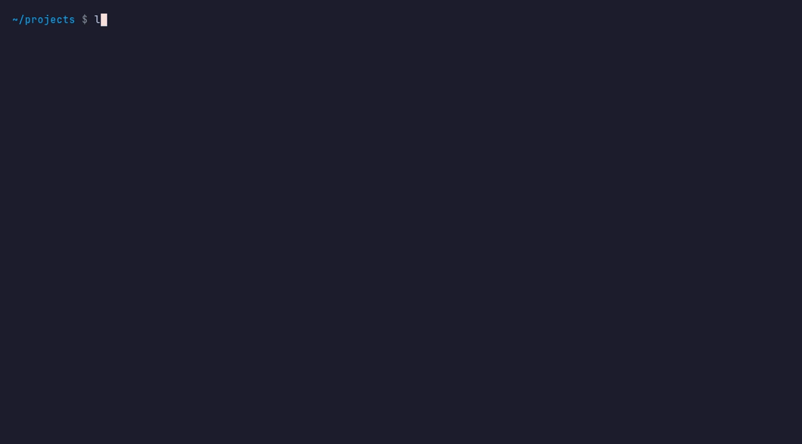
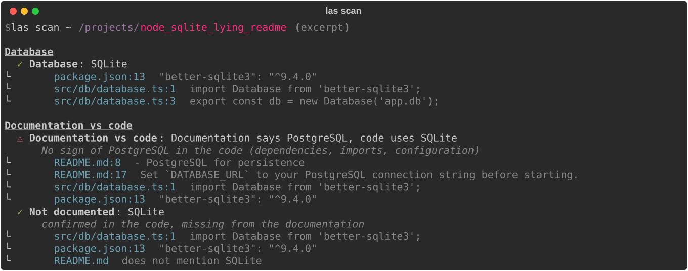

<p align="center">
  <picture>
    <source media="(prefers-color-scheme: dark)" srcset="site/public/brand/logo-dark.png">
    
  </picture>
</p>

<p align="center">
  <a href="https://deltaxmodules.github.io/LocalAlibiScan/"><b>Manual</b></a> ·
  <a href="https://deltaxmodules.github.io/LocalAlibiScan/#see-it-in-90-seconds">Demo video</a> ·
  <a href="https://deltaxmodules.github.io/LocalAlibiScan/example/">Example report</a>
</p>

LocalAlibiScan is a local, read-only tool that tells you what every project on
your disk is, what state it is in and what changed — and **proves every
statement with the file and line it came from**.



## Why

1. **Facts with proof.** Code extracts the facts; an LLM (optional) only writes
   prose about them. Every statement is a *claim* with a status and evidence.
2. **Your whole disk, not one repository.** One dashboard for every project in a
   folder, including loose script folders without git or manifests.
3. **Documentation that lies.** README vs code, with proof on both sides — and it
   never edits anything.
4. **Changes in architecture language.** "An OpenAI service appeared" and
   "New route `DELETE /notes/:id`", not "+42 lines".
5. **Works without an LLM.** Everything essential is deterministic. A local
   [Ollama](https://ollama.com) model is an extra, never a requirement.



## Install

```bash
pipx install localalibiscan            # once published on PyPI
pipx install git+https://github.com/deltaxmodules/LocalAlibiScan   # today
```

Python 3.11+ on macOS, Linux or Windows. The commands `localalibiscan` and the
shortcut `las` are equivalent.

## Quick start

```bash
las dashboard ~/code            # every project under ~/code (add --html for a static report)
las scan ~/code/my-app          # full profile, one line of evidence per claim (--evidence for all)
las check ~/Downloads           # just the verdict: project, root, subfolder, probable project or not a project
las refresh ~/code/my-app       # what changed since the last scan, in architecture terms
las history ~/code/my-app       # one line per previous scan
las explain ~/code/my-app       # "explain this project": fixed questions answered with facts
las ask ~/code/my-app "Where is authentication done?"
las files ~/code/my-app         # files that would be analysed (respects .gitignore)
las config --init               # create ~/.localalibi/config.toml
```

`las dashboard --html` writes a single self-contained file to
`~/.localalibi/dashboard.html` (no server, no external resources). See an
[example report built from well-known open-source projects](https://deltaxmodules.github.io/LocalAlibiScan/example/)
(Express, Flask, httpx, Vite, the FastAPI full-stack template, …).

> The terminal output and the HTML report are currently in **Portuguese**; the [manual](https://deltaxmodules.github.io/LocalAlibiScan/) explains every screen in English.

## Claims

Everything shown is a `Claim`:

```json
{
  "id": "db.sqlite",
  "category": "database",
  "label": "Base de dados",
  "value": "SQLite",
  "status": "confirmed",
  "evidence": [
    {"file": "package.json", "line": 13, "snippet": "\"better-sqlite3\": \"^9.4.0\"", "kind": "dependency"},
    {"file": "src/db/database.ts", "line": 3, "snippet": "export const db = new Database('app.db');", "kind": "code"}
  ],
  "source": "detector:database"
}
```

| Status | Symbol | Meaning |
|---|---|---|
| `confirmed` | ✓ | Proven by strong evidence (dependency **and** usage in code, or explicit code) |
| `inferred` | ≈ | Weak evidence (only a dependency, only a config hint, or AI prose written from facts) |
| `contradiction` | ⚠ | Two sources disagree (e.g. README vs code) |
| `unknown` | ? | Could not be determined — never invented |

A dependency that is declared but never imported stays `≈`; usage in code
without a declared dependency is `✓` with a note.

## What it detects

- **Folder verdict** — project, folder of projects, subfolder of a project,
  probable project (loose scripts/notebooks) or not a project.
- **Inventory** — languages, manifests (`package.json`, `requirements.txt`,
  `pyproject.toml`, `go.mod`, `Cargo.toml`, `composer.json`) with line numbers,
  project type, monorepo components, entry points, main folders, docs.
- **Code** (tree-sitter: Python, JavaScript, TypeScript) — databases and ORMs,
  frameworks, external services (OpenAI, Anthropic, Ollama, Stripe, AWS,
  Supabase, …), HTTP routes (FastAPI, Flask, Express, Fastify, Next.js) and a
  ranking of the most important files. Tests, examples, playgrounds and
  templates never count as evidence.
- **Docs vs code** — contradictions, "only in the docs" and "not documented".
- **History** — snapshots with file hashes (works without git).

Known limitations are listed in [`docs/limitacoes.md`](docs/limitacoes.md).

## Guarantees

- **Read-only.** The only writes go to `<project>/.localalibi/` (which ignores
  itself in git) and `~/.localalibi/`. Any other write raises an exception.
- **Never runs project code** — no scripts, tests or `npm install`. Git is only
  used through read commands (`rev-parse`, `log`, `status`).
- **No network**, except an optional Ollama server on `localhost`.
- **The LLM never creates facts.** It receives claims (never code), must cite
  claim ids (or `file:line` in `las ask`), and a validator drops every sentence
  without a valid citation. Without Ollama, you get facts only.

## Configuration

`~/.localalibi/config.toml` (create it with `las config --init`):

```toml
[scan]
ignore = ["vendor"]          # extra folders to skip (node_modules, .venv, dist, ... are always skipped)
max_file_size = 1048576      # larger files are listed but not read

[dashboard]
depth = 2                    # how deep to look for projects

[ollama]
url = "http://localhost:11434"   # only localhost is accepted
model = "qwen2.5-coder:7b"
timeout = 180
```

Environment variables `LOCALALIBI_OLLAMA_MODEL` and `LOCALALIBI_OLLAMA_URL`
override the file.

The full manual is at **https://deltaxmodules.github.io/LocalAlibiScan/**, with a 90-second
[demo video](https://deltaxmodules.github.io/LocalAlibiScan/#see-it-in-90-seconds).

## Development

```bash
uv venv -p 3.12 .venv && uv pip install -p .venv -e '.[dev]'
.venv/bin/pytest
```

The tool was built phase by phase from [`SPEC.md`](SPEC.md) (in Portuguese);
contributor rules live in [`CLAUDE.md`](CLAUDE.md). Test projects are in
`tests/fixtures/`. The manual is in `site/` (VitePress; `cd site && npx vitepress dev .`), its
reference pages are generated with `python scripts/gen_reference.py`, and the demo video and GIF
are recorded with `scripts/demo-video.sh` ([how](docs/video/PLANO.md)).

## License

[MIT](LICENSE)
